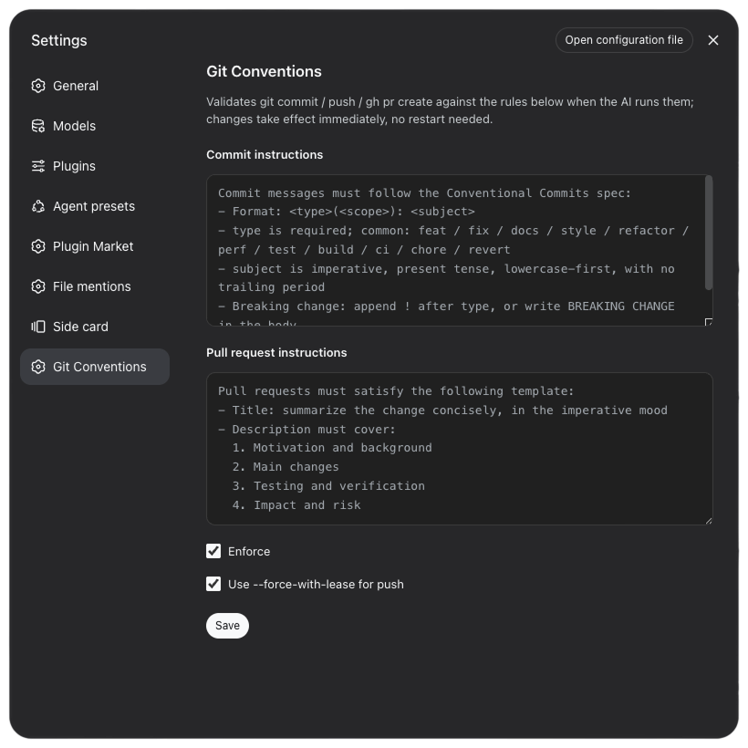
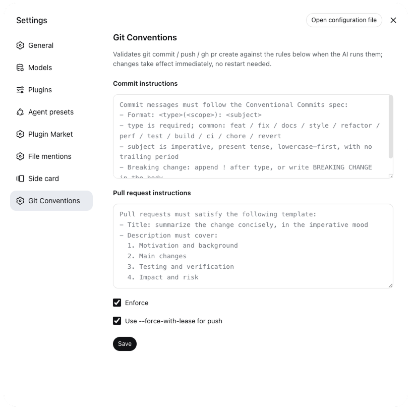

# @deepseek-ai/dsh-git-conventions

[简体中文](./README.md) | **English**

A configurable Git commit / push / pull request conventions plugin for DeepSeek Harness (static plugin, Host + Client). Rules are configured by the user in the settings page and persisted through the host settings provider (`dsh-settings-file` → `settings.yaml`); the interception logic hardcodes no rule text.

## Features

- **Commit message structural check**: inline `git commit -m` messages are validated against the Conventional Commits shape; non-conforming commits are denied, with the specific violations and the currently configured rules echoed back
- **Push safety hint**: when `git push` is called with a bare `--force` / `-f`, reminds to use `--force-with-lease` instead
- **PR completeness check**: `gh pr create` missing `--title` or `--body` is denied with guidance to fill them in
- **Zero hardcoded rules**: all rule text comes from the settings-page configuration; changes take effect immediately, no restart needed
- **One-click bypass**: turning off "Enforce" lets every command pass through
- **Bilingual UI**: the settings page and denial messages support Simplified Chinese / English, following the host locale preference — no extra setup

## Screenshots

The "Git Conventions" settings panel with the English UI and the default English rules (dark / light mode). The interface and the default rule text follow the host locale — see [Internationalization](#internationalization):





## Installation

Install into a target profile (`dsh plugin add` reads `dsh.bundle.patch` and appends the package name to `dsh.profile.bundles`):

```sh
dsh plugin --profile web add <path-to-package>
```

Restart `dsh web` — a standalone "Git Conventions" page then appears in the settings.

For local development, `dsh plugin --profile web add <workspace-path>` creates a `link:` dependency (source changes take effect after a restart). The host resolves `import z from 'schemastery'` by the module's real path, so a resolvable dependency must be provided in the workspace, e.g.:

```sh
mkdir -p node_modules
ln -s ~/.dsh/profiles/web/node_modules/schemastery node_modules/schemastery
```

Installing by package name from npm needs no such link (the package is copied into the profile's `node_modules` and dependencies resolve along the profile).

## Configuration

Namespace `git-conventions`:

| Field | Type | Default | Description |
|---|---|---|---|
| `commitInstructions` | string | Conventional Commits spec (locale-dynamic, zh / en) | Commit message rules; echoed back as rewrite hints on violation |
| `prInstructions` | string | PR template (locale-dynamic, zh / en) | Pull request title/description rules |
| `enforce` | boolean | true | Enforce interception; when off, all commands pass |
| `useForceWithLease` | boolean | true | Remind to use `--force-with-lease` when a bare `--force` appears in `git push` |

Setting changes take effect immediately without restart.

## Internationalization

The plugin UI and denial messages support Simplified Chinese (`zh`) and English (`en`), following the host locale preference:

- **Switching**: choose the language in dsh settings → General → Language, persisted as `locale.preference` in `settings.yaml`. When unset, the client falls back to the browser language and the host falls back to Chinese.
- **UI copy and default rule text** (settings title, labels, buttons, status messages, textarea placeholders, guard fallback) both switch immediately — no restart needed.
- **Custom rule text is language-independent**: once saved, it always wins over the defaults.

## Usage examples

### Compliant: passes through

```sh
git commit -m "feat(agent): add git commit convention interception"
git commit -m "fix(commit): handle empty subject edge case"
git push --force-with-lease
gh pr create --title "feat: support scope validation" \
  --body "Motivation / changes / testing / impact"
```

### Non-compliant: denied

```sh
# Missing <type>(<scope>): <subject> prefix → denied
git commit -m "add convention interception"

# subject ends with a period → denied
git commit -m "feat: add convention interception."

# bare --force (when useForceWithLease=true) → reminded to use --force-with-lease
git push --force
git push -f

# Missing PR title or body → denied
gh pr create --title "feat: add validation"      # no --body
gh pr create --body "missing title"              # no --title
```

On denial, the reason lists the specific violations, the full currently configured rules, and asks to rewrite and resubmit. For example, a `git commit` denial looks like:

```
Commit message does not conform to the configured commit rules:
  - The first line must match "<type>(<scope>): <subject>", e.g. "feat(agent): ..."

Current commit rules:
<the commitInstructions text from your settings — echoed verbatim>

Please rewrite and commit again.
```

The denial message echoes your configured rule text verbatim: configure `commitInstructions` / `prInstructions` in English and the messages come back in English.

### Not intercepted

- `git commit -F commit-msg.txt`: file-based commit messages (the guard is synchronous and cannot read file contents)
- All commands when "Enforce" is off (`enforce=false`)
- A rule text left empty (or cleared) falls back to the current locale's default rules — validation still applies

## How it works

On the Host side, the plugin intercepts the `bash` tool through `ctx.tools.guard()` (a monotonic guard):

- `git commit` with `-m`/`--message` extracts the message and runs the Conventional Commits structural check; non-conforming commits are denied with the specific violations, the full configured rules, and a request to rewrite.
- `git push` with a bare `--force`/`-f` while `useForceWithLease=true` reminds to use `--force-with-lease`.
- `gh pr create` missing `--title` or `--body` echoes `prInstructions` and denies.

## Known limitations

- The `tools/execute` pipeline offers no argument injection, so the PR "validate/inject" step is implemented as validation: a missing title/description is denied with fill-in guidance.
- The guard is synchronous and cannot read `-F`/`--file` targets; file-based messages are not intercepted (only inline `-m`/`--message` messages are handled).
- The structural check is a generic Conventional Commits shape check; the concrete rule text comes from the settings page and is echoed verbatim in denials.

## License

MIT License © 2026 雨果. See [LICENSE](LICENSE).
