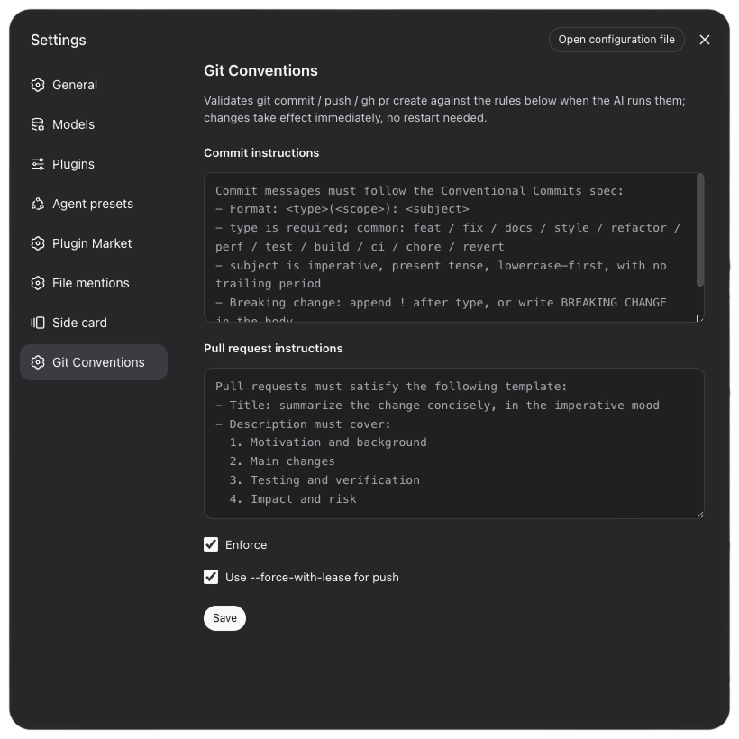
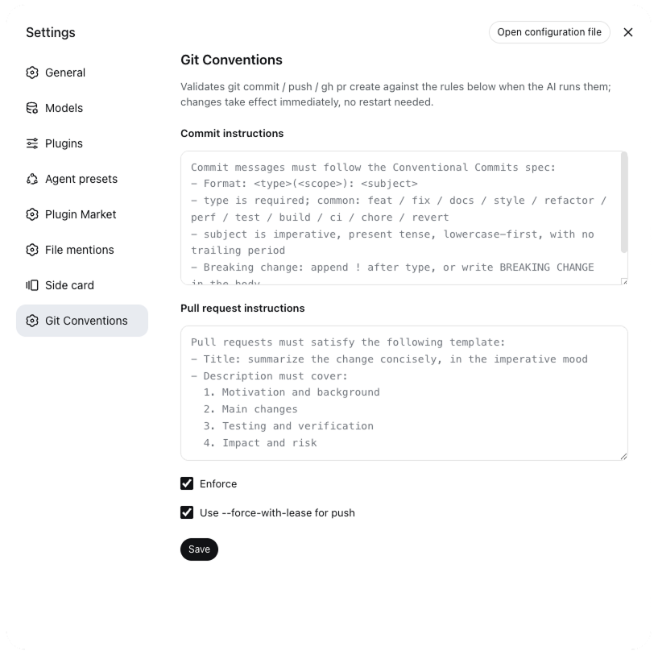

# dsh-git-conventions

Compatible with the DSH `0.1.7-rc.2` Config / volatile API; the removed `settings.register` API is no longer used. Back up configuration before upgrading. If DSH already renamed legacy settings to `settings.yaml.imported` while the plugin failed to load, restore this plugin’s settings from that backup into the active profile without replacing the whole profile.

[简体中文](./README.md) | **English**

[](https://www.npmjs.com/package/dsh-git-conventions)
[](https://github.com/CN-WenYu/dsh-git-conventions/blob/main/LICENSE)

A configurable Git commit / push / pull request conventions plugin for DeepSeek Harness (static plugin, Host + Client). Fixed structural checks are paired with configurable rewrite guidance, persisted in the active profile’s `cordis.patch.yml`. Custom text is echoed on denial; it is neither an executable policy nor proactively injected into model context.

## Features

- **Commit message validation**: inline `git commit -m` messages are checked against the Conventional Commits shape; non-conforming commits are denied, echoing the violations and the currently configured rules
- **Push safety**: `--force`, `-f` (including combined short options), or a `+refspec` in `git push` prompts switching to `--force-with-lease`
- **PR completeness**: `gh pr create` missing a nonempty title or body source (`--body` / `--body-file`) is denied with fill-in guidance
- **Configurable rewrite guidance**: fixed checks cover Conventional Commits structure, empty messages, trailing periods and required PR arguments; custom language, scope and section requirements remain guidance
- **One-click bypass**: turning off "Enforce" lets every command pass through
- **Bilingual**: the settings page and denial messages support Simplified Chinese / English, following the host locale preference

## Screenshots

These are historical UI examples. The current page uses the host’s default navigation icon and updated explanatory text and save behavior.

The "Git Conventions" settings panel with the English UI and the default English rules (dark / light mode). The interface and the default rule text follow the host locale — see [Internationalization](#internationalization):





## Installation

This package is published to [npm](https://www.npmjs.com/package/dsh-git-conventions) — install by name into a target profile. `dsh plugin add` reads the `cordis.patch.yml` referenced by `dsh.bundle.patch` in `package.json` and appends the package name to `dsh.profile.bundles`:

```sh
dsh plugin --profile web add dsh-git-conventions
dsh web
```

Restart — a standalone "Git Conventions" page then appears in the settings. To update or remove:

```sh
dsh plugin --profile web update dsh-git-conventions   # update
dsh plugin --profile web remove dsh-git-conventions  # uninstall
```

### Local development

Installing by workspace path creates a `link:` dependency (source changes take effect after a restart). The host resolves `import z from '@deepseek-ai/schemastery'` by the module's real path, so a resolvable dependency must be provided in the workspace:

```sh
dsh plugin --profile web add <path-to-package>
npm ci
```

Installing by package name from npm needs no manual workspace dependency install (the package is copied into the profile's `node_modules` and dependencies resolve along the profile).

## Configuration

Namespace `git-conventions`:

| Field | Type | Default | Description |
|---|---|---|---|
| `commitInstructions` | string | Conventional Commits spec (locale-dynamic, zh / en) | Rewrite guidance echoed when a fixed structural check rejects a command |
| `prInstructions` | string | PR template (locale-dynamic, zh / en) | PR rewrite guidance; does not enforce description sections |
| `enforce` | boolean | true | Enforce interception; when off, all commands pass |
| `useForceWithLease` | boolean | true | Remind to use `--force-with-lease` when a force option or `+refspec` appears in `git push` |

Save submits all edited fields in one atomic host mutation. Clean forms follow host updates. If settings change elsewhere during editing, the revision fence refuses the save; use “Reload settings” to discard the draft and edit again.

## Internationalization

The UI copy, default rule text, and denial messages support `zh` / `en`, following the host locale preference (dsh settings → General → Language, persisted as `preference` on the active profile’s `locale` entry). When unset, the client falls back to the browser language and the host falls back to Chinese. Custom rule text is language-independent: once saved, it always wins over the defaults.

## Usage examples

### Compliant: passes through

```sh
git commit -m "feat(agent): add git commit convention interception"
git commit -m "fix(commit): handle empty subject edge case"
git push --force-with-lease
gh pr create --title "feat: support scope validation" \
  --body "Motivation / changes / testing / impact"
```

### Non-compliant: denied

```sh
# Missing <type>(<scope>): <subject> prefix → denied
git commit -m "add convention interception"

# subject ends with a period → denied
git commit -m "feat: add convention interception."

# bare --force (when useForceWithLease=true) → reminded to use --force-with-lease
git push --force
git push -f

# Missing PR title or body → denied
gh pr create --title "feat: add validation"      # no --body
gh pr create --body "missing title"              # no --title
```

On denial, the reason lists the specific violations, the full currently configured rules, and asks to rewrite and resubmit. For example, a `git commit` denial looks like:

```
Commit message does not conform to the configured commit rules:
  - The first line must match "<type>(<scope>): <subject>", e.g. "feat(agent): ..."

Current commit rules:
<the commitInstructions text from your settings — echoed verbatim>

Please rewrite and commit again.
```

The denial message echoes your configured rule text verbatim: configure `commitInstructions` / `prInstructions` in English and the messages come back in English.

### Scope and defaults

- `git commit -F commit-msg.txt`: file-based commit messages (file contents are not inspected)
- All commands when "Enforce" is off (`enforce=false`)
- A rule text left empty (or cleared) falls back to the current locale's default rules — validation still applies

## How it works

On the Host side, the plugin guards the `bash` tool through `ctx.tools.guard()`:

- `git commit` with `-m` / `--message` extracts the message and runs the Conventional Commits structural check; non-conforming commits are denied with the specific violations, the full configured rules, and a request to rewrite.
- `git push` with `--force`, `-f` (including combined flags), or a `+refspec` while `useForceWithLease=true` reminds to use `--force-with-lease`.
- `gh pr create` missing a nonempty title or body source (`--body` / `--body-file`) echoes `prInstructions` and denies.

## Known limitations

- Only common explicit commands in the `bash` tool are inspected. Arguments are not rewritten. PowerShell, external scripts, aliases and other execution tools are outside scope; this is not an unbypassable security boundary.
- Ordinary quoting, empty arguments, command separators and common redirections are supported. Variable expansion, command substitution, here-documents and complex shell syntax are not evaluated; commands containing unresolved variables/globs are skipped, and calls containing command substitution, parentheses, here-documents or unmatched quotes are left unchecked. This is a best-effort guard, not a complete Bash parser.
- `gh pr create` (including `gh pr new`) accepts `--body-file` / `-F` as a body source without checking file or stdin contents. `--fill` and editor workflows are not automatically accepted as complete.
- The plugin does not read `-F` / `--file` targets; file-based messages are not validated (only inline `-m` / `--message` messages are handled).
- Custom text does not change the fixed checks: language, required scope, imperative mood and PR sections are not automatically validated.

## License

MIT License © 2026 雨果. See [LICENSE](LICENSE).
