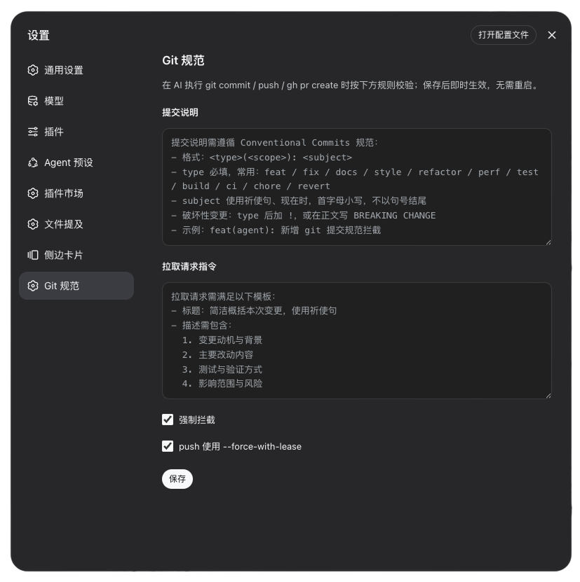
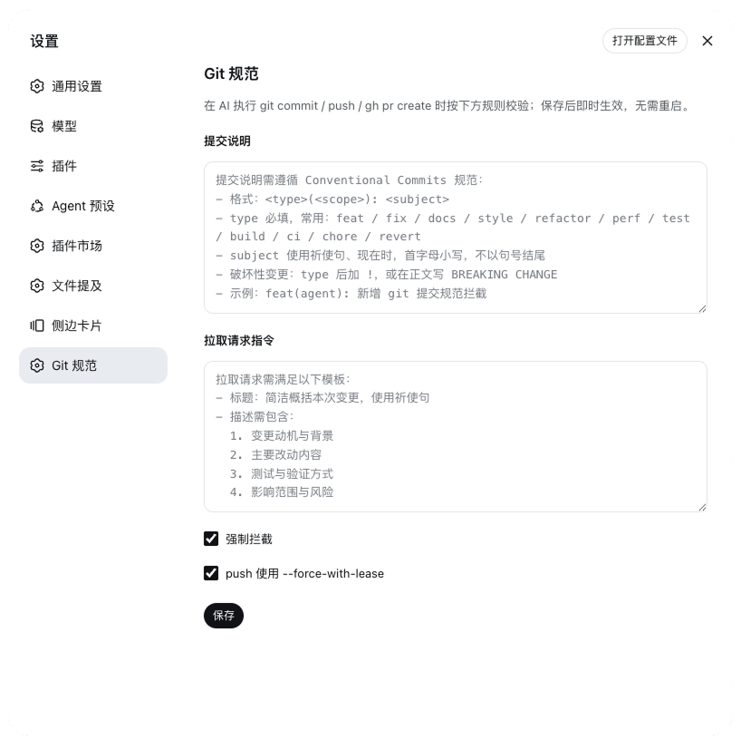

# dsh-git-conventions

**简体中文** | [English](./README.en.md)

[](https://www.npmjs.com/package/dsh-git-conventions)
[](https://github.com/CN-WenYu/dsh-git-conventions/blob/main/LICENSE)

为 DeepSeek Harness 提供可配置的 Git 提交 / 推送 / 拉取请求规范（静态插件，Host + Client 双端）。规则文本由用户在设置页配置，经宿主 settings 持久化到 `settings.yaml`；拦截逻辑不硬编码任何规则。

## 功能特性

- **提交规范校验**：对 `git commit -m` 的内联消息做 Conventional Commits 结构检查，不合规即拒绝，并回显不合规点与当前规则
- **推送安全**：`git push` 使用裸 `--force` / `-f` 时，提示改用 `--force-with-lease`
- **PR 完整性**：`gh pr create` 缺少 `--title` / `--body` 时拒绝，并给出补齐提示
- **规则零硬编码**：规则文本只来自设置页配置，保存后即时生效，无需重启
- **一键放行**：关闭「强制拦截」后守卫不再介入，全部命令放行
- **多语言**：设置页与拦截消息支持简体中文 / 英文，跟随宿主语言偏好

## 截图

设置页中的「Git 规范」面板（深色 / 浅色模式；图中为默认中文规则示例，可在设置页改为任意语言）：





## 安装

本包已发布到 [npm](https://www.npmjs.com/package/dsh-git-conventions)，在目标 profile 按包名安装即可。`dsh plugin add` 会读取 `package.json` 中 `dsh.bundle.patch` 指向的 `cordis.patch.yml`，并把包名追加进 `dsh.profile.bundles`：

```sh
dsh plugin --profile web add dsh-git-conventions
dsh web
```

重启后设置页出现独立的「Git 规范」页。更新 / 卸载：

```sh
dsh plugin --profile web update dsh-git-conventions   # 更新
dsh plugin --profile web remove dsh-git-conventions  # 卸载
```

### 本地开发

以工作区路径安装会建立 `link:` 依赖（改源码后重启即生效）。此时宿主解析 `import z from 'schemastery'` 走模块真实路径，需在工作区补一个可解析的依赖：

```sh
dsh plugin --profile web add <本包路径>
mkdir -p node_modules
ln -s ~/.dsh/profiles/web/node_modules/schemastery node_modules/schemastery
```

按 npm 包名安装则无需该链接（包被复制进 profile 的 `node_modules`，依赖沿 profile 正常解析）。

## 配置项

命名空间 `git-conventions`：

| 字段 | 类型 | 默认 | 含义 |
|---|---|---|---|
| `commitInstructions` | string | Conventional Commits（zh/en 随语言） | 提交说明规则；违规时作为重写提示回显 |
| `prInstructions` | string | PR 模板（zh/en 随语言） | 拉取请求标题 / 描述规则 |
| `enforce` | boolean | true | 是否强制拦截；关闭后全部放行 |
| `useForceWithLease` | boolean | true | `git push` 出现裸 `--force` 时提醒改用 `--force-with-lease` |

任何修改即时生效，无需重启。

## 国际化

界面文案、默认规则文本与拦截消息均支持 `zh` / `en`，跟随宿主语言偏好（dsh 设置 → 通用 → 语言，持久化为 `settings.yaml` 的 `locale.preference`）。未显式选择时，客户端回退浏览器语言，服务端回退中文。自定义规则文本与语言无关，一旦保存始终优先于默认规则。

## 使用示例

### 合规：正常放行

```sh
git commit -m "feat(agent): 新增 git 提交规范拦截"
git commit -m "fix(commit): 修正 subject 校验的空消息边界"
git push --force-with-lease
gh pr create --title "feat: 支持 scope 校验" \
  --body "动机与背景 / 主要改动 / 测试与验证 / 影响范围"
```

### 违规：被拦截

```sh
# 缺少 <type>(<scope>): <subject> 前缀 → 拒绝
git commit -m "新增提交规范拦截"

# subject 以句号结尾 → 拒绝
git commit -m "feat: 新增提交规范拦截。"

# 裸 --force（useForceWithLease=true 时）→ 提醒改用 --force-with-lease
git push --force
git push -f

# 缺少 PR 标题或描述 → 拒绝
gh pr create --title "feat: 新增校验"          # 缺 --body
gh pr create --body "缺少标题"                  # 缺 --title
```

拦截时 reason 列出具体不合规点、当前配置的完整规则文本，并提示「请重写后重新提交」。以 `git commit` 为例，agent 收到的拒绝消息形如：

```
提交信息不符合配置的提交说明规则：
  - 提交首行需符合 "<type>(<scope>): <subject>" 格式，例如 "feat(agent): 说明"

当前提交说明规则：
提交说明需遵循 Conventional Commits 规范：
- 格式：<type>(<scope>): <subject>
- type 必填，常用：feat / fix / docs / style / refactor / perf / test / build / ci / chore / revert
- subject 使用祈使句、现在时，首字母小写，不以句号结尾
- 破坏性变更：type 后加 !，或在正文写 BREAKING CHANGE
- 示例：feat(agent): 新增 git 提交规范拦截

请重写后重新提交。
```

### 不被拦截的情况

- `git commit -F commit-msg.txt`：守卫同步执行，无法读取文件内容
- 关闭「强制拦截」（`enforce=false`）后的所有命令
- 规则文本留空（或清空）时回退到当前语言默认规则，校验仍生效

## 工作原理

Host 端通过 `ctx.tools.guard()` 守卫 `bash` 工具：

- `git commit` 带 `-m` / `--message` 时提取消息并做 Conventional Commits 结构校验；不合规则 deny，reason 含不合规点、完整规则与「请重写后重新提交」。
- `git push` 含裸 `--force` / `-f` 且 `useForceWithLease=true` 时，提醒改用 `--force-with-lease`。
- `gh pr create` 缺少 `--title` 或 `--body` 时按 `prInstructions` 回显并拒绝。

## 已知限制

- `tools/execute` 管道不提供参数改写，因此 PR 的“校验 / 注入”实现为校验：缺失标题 / 描述时拒绝并给出补齐提示。
- 守卫同步执行，无法读取 `-F` / `--file` 指向的文件，文件消息不拦截（仅处理 `-m` / `--message` 内联消息）。
- 结构校验为通用 Conventional Commits 形状检查；具体规则以设置页配置为准，并在拒绝原因中原样回显。

## 许可证

MIT License © 2026 雨果，详见 [LICENSE](LICENSE)。
